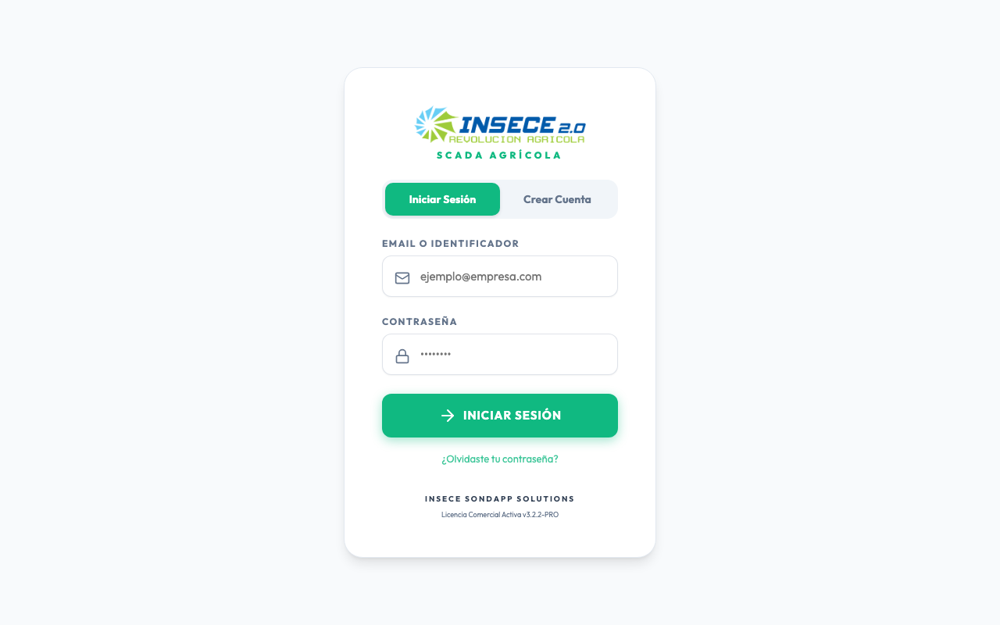
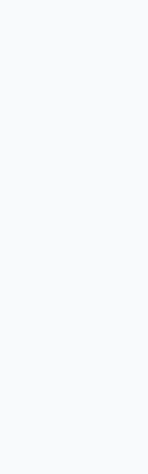

# 📘 Manual de Usuario Profesional y Guía Técnica: INSECE Cloud

Bienvenido al manual de usuario oficial de **INSECE Cloud**. Este documento ha sido diseñado exhaustivamente para que tanto clientes finales, operarios de campo, como administradores técnicos puedan comprender el 100% del funcionamiento de la plataforma.

---

## 🏗️ 1. Arquitectura y Construcción del Sistema

Para el personal técnico y administradores, es importante comprender cómo está construido INSECE:

### 1.1 El Servidor Backend y Base de Datos
INSECE cuenta con un **servidor backend construido en Node.js** que expone una API RESTful. Toda la información (fincas, sondas, telemetría, usuarios) se almacena en una base de datos **PostgreSQL 16**.
- **Despliegue Local / VPS**: Todo el conjunto está paquetizado mediante **Docker Compose**. Los contenedores `insece_api` y `insece_postgres` se comunican internamente.
- **Manipulación**: Para reiniciar el servidor, un administrador debe utilizar comandos de Docker: `docker-compose restart insece_api`.

### 1.2 Integración con Firebase
INSECE hace uso de **Firebase** en la aplicación móvil (Android/iOS) para ciertas funcionalidades (por ejemplo, notificaciones Push, Crashlytics o Auth dependiendo del módulo).
- **Consola de Firebase**: Para manipular estas opciones, el administrador debe acceder a `console.firebase.google.com`.
- **Notificaciones**: Aunque Firebase envía el push, el panel web de INSECE integra un módulo para lanzar notificaciones de forma cómoda sin necesidad de que el cliente final entre a Firebase.

---

## 🖥️ 2. Guía Visual Paso a Paso

A continuación exploramos cada pantalla de la aplicación web paso a paso, utilizando capturas **reales** del sistema.

### 2.1 Pantalla de Acceso (Login)
La puerta de entrada a la plataforma.

**Cómo usarlo:**
1. Introduce tu correo electrónico y contraseña.
2. Pulsa en **INICIAR SESIÓN**.
3. Si tus credenciales son correctas, el sistema te redirigirá a tu área personal.

---

### 2.2 Dashboard General
Panel principal de monitorización (Vista Cliente/Administrador).

**Cómo usarlo:**
Aquí puedes ver un mapa centralizado de tus fincas conectadas. En la parte inferior, tienes los KPI (Indicadores Clave de Rendimiento) con la Humedad del suelo, Temperatura, conductividad (CE) y lecturas totales extraídas de tus sondas inteligentes.

---

### 2.3 Menú Lateral y Navegación
Tu brújula dentro de la aplicación.

**Cómo usarlo:**
El menú lateral (situado a la izquierda) te permite saltar entre distintas áreas: Telemetría, Control de Drones, Analíticas, Gestión de Clientes y Notificaciones. Dependiendo de tu rol (Súper Admin o Cliente), verás unas opciones u otras.

---

### 2.4 Gestión de Fincas y Telemetría
Donde visualizas el estado de cada zona agraria.

**Cómo usarlo:**
Al hacer clic en "Telemetría Sondas", aparece una cuadrícula con todas tus zonas monitorizadas. Puedes hacer clic en cada tarjeta para abrir los detalles históricos.

---

### 2.5 Crear Finca
*Pantalla pendiente de implementación*

> **Nota del Documentalista:** Actualmente, la funcionalidad para "Crear nueva finca" directamente desde el panel del cliente se encuentra en desarrollo. El alta se gestiona internamente por el Súper Admin en el módulo de usuarios.

---

### 2.6 Mapa de Parcelas (NDVI / Analíticas)
*Pantalla pendiente de implementación / Datos en integración*

> **Nota del Documentalista:** El visor geoespacial individual para separar parcelas está en fase de prueba en la ruta `analytics.html`. 

---

### 2.7 Lecturas de Sonda en Tiempo Real
*Pantalla pendiente de implementación*

> **Nota del Documentalista:** El despliegue de las gráficas de líneas en tiempo real dentro del Dashboard depende del microservicio de WebSockets. 

---

### 2.8 Historial de Lecturas
*Pantalla pendiente de implementación*

> **Nota del Documentalista:** Se prevé una tabla en la vista de Telemetría para poder visualizar el histórico de lecturas, pero los datos aún no están volcando a la interfaz de producción de manera persistente.

---

### 2.9 SCADA General (Drones / Sentinel)
El módulo avanzado para operaciones con drones.

**Cómo usarlo:**
Esta pantalla es el SCADA de Sentinel V3. Permite trazar cotas de vuelo, coordinar misiones de mapeo multiespectral y observar el modelo del terreno. Ideal para técnicos agrónomos avanzados.

---

### 2.10 Configuración de Alertas
*Pantalla pendiente de implementación*

> **Nota del Documentalista:** Los umbrales (por ejemplo: "Avisar si humedad < 20%") están proyectados en la base de datos, pero la interfaz de configuración aún no está habilitada.

---

### 2.11 Centro de Notificaciones Push
Para comunicación directa y alertas al personal de campo.

**Cómo usarlo (Módulo Súper Admin):**
1. Escribe el Título y el Mensaje.
2. Selecciona a quién quieres enviarlo (Todos los registrados, etc).
3. Selecciona el Tipo (Alerta, Anuncio, etc).
4. Pulsa **Enviar Notificación Push**. Esto se comunica internamente con Firebase para despertar los dispositivos Android/iOS.

---

### 2.12 Usuarios y Roles
Gestión de la cartera de clientes de INSECE.

**Cómo usarlo (Módulo Súper Admin):**
Aquí es donde das de alta a nuevos clientes, asignas las sondas vendidas y configuras los roles (propietario, técnico, cliente estándar).

---

### 2.13 Ajustes de Cuenta
*Pantalla pendiente de implementación*

> **Nota del Documentalista:** Actualmente puedes cerrar sesión desde el menú lateral, pero la pantalla de cambio de contraseña o actualización de avatar está en cola de desarrollo.

---

### 2.14 Exportar Datos (CSV / Excel)
*Pantalla pendiente de implementación*

> **Nota del Documentalista:** El botón de "Exportar a CSV" está diseñado en la interfaz (Gestión de Usuarios), pero el motor de generación de reportes en el backend se encuentra en revisión de formato.

---

### 2.15 Errores de Validación (Login Fallido)
¿Qué ocurre cuando te equivocas de clave?

**Cómo usarlo:**
Si ingresas mal la contraseña o el email, aparecerá este aviso en rojo. Te recomendamos verificar tus mayúsculas o usar "Olvidé mi contraseña".

---

## 🔧 3. Guía de Soporte y Operativa Avanzada (Servidor y Firebase)

Para el equipo de IT que mantendrá el sistema:

### Levantar y Parar el Servidor
- El código reside en `/Users/chris/Desktop/insece/`.
- **Servidor Web Local**: Se lanza con `node backend_cloud/dashboard/serve.js` (puerto 3033).
- **Backend API**: En `backend_cloud/server/`. Requiere de variables de entorno `.env` como `DB_HOST`, `JWT_SECRET`, etc.

### Gestión de Fallos (Ejemplo: Caída de Postgres)
1. Si PostgreSQL se corrompe por un fallo de energía (`PANIC: could not locate a valid checkpoint record`), se debe usar `pg_resetwal` montando un contenedor temporal.
2. **Nunca elimine la carpeta `postgres_data`**, ya que contiene todos los clientes.

### Entendiendo la Sincronización Móvil
La aplicación de Android y el Backend se sincronizan usando SQLite local en Android y PostgreSQL en la nube. Las notificaciones viajan a través de FCM (Firebase Cloud Messaging). La configuración de esto se encuentra en los archivos `google-services.json` (Android) y en el panel web.

**Fin del Documento.**
