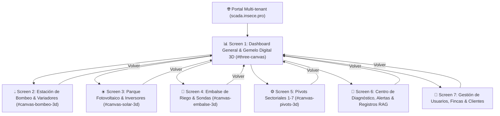

# Plan de Implementación Detallado por Pantalla SCADA 3D — INSECE AgTech Ecosystem

Este documento define el **Plan de Implementación Arquitectónico y Visual por Pantalla** para el ecosistema industrial/agrícola INSECE SCADA (`https://campillo-el-negro.scada.insece.pro/` y `https://scada.insece.pro/`), cumpliendo con la norma internacional **ISA-101 HMI**, renderizado 3D de alta fidelidad **Three.js PBR** y sincronización de telemetría **Modbus / WebSocket en tiempo real**.

---

## 1. Mapa General de Pantallas del Ecosistema

---

## 2. Plan Detallado Pantalla por Pantalla

---

### 📊 SCREEN 1: Dashboard Principal & Gemelo Digital 3D General

#### 1. Objetivo y Nivel ISA-101
- **Nivel HMI**: Nivel 1 — Visión General Panorámica Finca (Overview / Situation Awareness).
- **Finalidad**: Brindar una vista cinematográfica 3D en 360° de toda la finca **Campillo El Negro**, integrando todos los subsistemas (bombeo, embalse, solar, pívots) en una sola escena tridimensional con la barra superior de KPIs globales.

#### 2. Especificación del Modelo 3D (Three.js PBR)
- **Lienzo**: `#three-canvas` (`position:fixed; 100vw x 100vh`).
- **Geometría 3D**:
  - Terreno topográfico derivado de datos satelitales con mapa de relieve.
  - Representación 3D en mapa de la estación de bombeo, parque solar, embalse y los 7 pívots circulares.
  - Arcos de luz y energía conectando la planta fotovoltaica con la caseta de bombeo (`THREE.QuadraticBezierCurve3`).
- **Materiales PBR**:
  - Terreno: `THREE.MeshStandardMaterial` (`roughness: 0.9`).
  - Arcos de energía: `THREE.MeshBasicMaterial` con resplandor pulsante en vivo (`emissiveIntensity: 3.0`).
- **Iluminación**: Sombras suaves `THREE.PCFSoftShadowMap`, luz solar `DirectionalLight` y niebla de atmósfera volumétrica (`THREE.FogExp2(0x060b18, 0.008)`).

#### 3. Data Binding de Telemetría (Tags Modbus / WebSocket)
- Presión General: `STATE.bgBar` / `STATE.pz3Bar` (`#dashKpiPresion`).
- Volumen Embalse: `STATE.embVol` (`#dashKpiEmbalse`).
- Potencia Solar: `STATE.pwrReal` (`#dashKpiSolar`).
- Frecuencia Maestro: `STATE.pz3Hz` (`#dashKpiHz`).

#### 4. Interacción y Controles
- Órbita 3D suave cinemática (`camUpdate()`) con soporte de arrastre de ratón y zoom con rueda.
- Modo alternable entre **Gemelo Digital 3D** y **Mapa Satélite 2D (Leaflet High-Res)**.

---

### 💧 SCREEN 2: Estación de Bombeo Principal & Filtros (Pantalla 3D Dedicada)

#### 1. Objetivo y Nivel ISA-101
- **Nivel HMI**: Nivel 2 — Control de Proceso de Impulsión y Filtrado.
- **Finalidad**: Supervisar el estado físico de los 3 variadores de frecuencia Schneider Altivar, la presión de pozo, la potencia consumida y el estado de la batería de filtros.

#### 2. Especificación del Modelo 3D (Three.js PBR)
- **Lienzo**: `#canvas-bombeo-3d` (`position:absolute; 100vw x 100vh`).
- **Geometría 3D**:
  - Suelo industrial de hormigón pulido con bancada de acero anticorrosivo.
  - 3 Bombas centrífugas de gran caudal con voluta de fundición, bridas de aspiración/impulsión y motores de refrigeración por aletas.
  - Manómetros de dial metálico con aguja indicadora física de presión en bar.
  - Tuberías transparentes de policarbonato con partículas de flujo de agua interna en movimiento.
  - Armarios eléctricos Schneider Altivar VFD con interruptor general, pantalla digital de Hz y LEDs Modbus de comunicación.
- **Materiales PBR**:
  - Voluta de bombas: `THREE.MeshPhysicalMaterial` (`color: 0x0284c7`, `metalness: 0.9`, `clearcoat: 0.6`).
  - Tuberías cristalinas: `THREE.MeshPhysicalMaterial` (`transmission: 0.7`, `opacity: 0.75`, `roughness: 0.1`).
  - Cromados y manómetros: `THREE.MeshStandardMaterial` (`metalness: 0.98`, `roughness: 0.05`).

#### 3. Data Binding de Telemetría (Tags Modbus / WebSocket)
- **Pozo 3 Maestro**: Frecuencia (`#scPozo3Hz`), Potencia (`#scPozo3Kw`), Corriente (`#scPozo3A`), Presión (`#scPozo3Bar`).
- **Bomba 2 Impulso**: Frecuencia (`#scBomba2Hz`), Potencia (`#scBomba2Kw`), Presión Salida (`#scBomba2Bar`).
- **Bomba Goteo**: Frecuencia (`#scBombaGoteoHz`), Potencia (`#scBombaGoteoKw`), Presión Goteo (`#scBombaGoteoBar`).

#### 4. Interacción y Controles
- Órbita 3D independiente con el ratón (`setupSubOrbit('bombeo')`).
- HUD transparente flotante (Glassmorphism) con botón de retorno al Dashboard.

---

### ☀️ SCREEN 3: Parque Fotovoltaico & Inversores Huawei SUN2000 (Pantalla 3D Dedicada)

#### 1. Objetivo y Nivel ISA-101
- **Nivel HMI**: Nivel 2 — Generación Eléctrica e Inyección a Red de Riego.
- **Finalidad**: Controlar el rendimiento de la planta solar, la curva de radiación W/m² y la potencia inyectada a los variadores de bombeo.

#### 2. Especificación del Modelo 3D (Three.js PBR)
- **Lienzo**: `#canvas-solar-3d` (`position:absolute; 100vw x 100vh`).
- **Geometría 3D**:
  - Matriz de seguidores fotovoltaicos a 1 eje con estructura de postes de acero galvanizado y marcos inclinados a 30°.
  - Módulos fotovoltaicos de cristal de silicona monocristalina con cuadrícula de busbars.
  - Estación Inversora Huawei SUN2000 central con rejillas de disipación térmica y conectores DC/AC.
- **Materiales PBR**:
  - Cristal fotovoltaico: `THREE.MeshPhysicalMaterial` (`color: 0x0a192f`, `clearcoat: 1.0`, `metalness: 0.9`, `emissive: 0x1d4ed8`).
  - Estructura metálica: `THREE.MeshStandardMaterial` (`metalness: 0.9`, `roughness: 0.2`).

#### 3. Data Binding de Telemetría (Tags Modbus / WebSocket)
- Potencia Generada Real: `STATE.pwrReal` (`#scSolarReal`).
- Potencia Estimada Teórica: `STATE.pwrEst` (`#scSolarEst`).
- Inyección Neta a Red: `STATE.pwrNet` (`#scSolarNet`).
- Radiación Solar Incidente: `STATE.radW` (`#scSolarRad`).

#### 4. Interacción y Controles
- Órbita 3D independiente (`setupSubOrbit('solar')`).
- HUD flotante con indicadores métricos en vivo.

---

### 🌊 SCREEN 4: Embalse de Riego & Sondas Hidrostáticas (Pantalla 3D Dedicada)

#### 1. Objetivo y Nivel ISA-101
- **Nivel HMI**: Nivel 2 — Almacenamiento Hidráulico y Nivel de Agua.
- **Finalidad**: Supervisar la capacidad del embalse de riego, la cota de nivel de agua en metros y la presión hidrostática en la solera.

#### 2. Especificación del Modelo 3D (Three.js PBR)
- **Lienzo**: `#canvas-embalse-3d` (`position:absolute; 100vw x 100vh`).
- **Geometría 3D**:
  - Balsa en talud con recubrimiento de geomembrana de alta densidad de color azul oscuro.
  - Plano de agua PBR fluido con sub-división de malla (`64x64`) deformado en tiempo real mediante algoritmos de olas por funciones armónicas (`Math.sin(u*1.5 + t*2.5)*0.06`).
  - Sonda hidrostática piezoeléctrica sumergida suspendida de un cable inoxidable.
- **Materiales PBR**:
  - Espejo de agua: `THREE.MeshPhysicalMaterial` (`color: 0x0284c7`, `transmission: 0.65`, `ior: 1.33`, `opacity: 0.88`).
  - Balsa de hormigón: `THREE.MeshStandardMaterial` (`roughness: 0.8`).

#### 3. Data Binding de Telemetría (Tags Modbus / WebSocket)
- Volumen Acumulado (m³): `STATE.embVol` (`#scEmbVol`).
- Cota de Nivel (m): `STATE.embLvl` (`#scEmbLvl`).
- Presión Hidrostática (bar): `STATE.embPrs` (`#scEmbPrs`).

#### 4. Interacción y Controles
- Ascenso y descenso en tiempo real del plano 3D de agua (`position.y`) en función de la telemetría real.
- Órbita 3D y HUD flotante.

---

### ⚙️ SCREEN 5: Pívots Sectoriales de Riego 1 al 7 (Pantalla 3D Dedicada)

#### 1. Objetivo y Nivel ISA-101
- **Nivel HMI**: Nivel 2 — Maquinaria de Riego de Avance Frontal y Circular.
- **Finalidad**: Controlar el ángulo de posicionamiento angular (0-360°), la velocidad %, la presión en boquilla y el estado de agua/seco de los 7 pívots.

#### 2. Especificación del Modelo 3D (Three.js PBR)
- **Lienzo**: `#canvas-pivots-3d` (`position:absolute; 100vw x 100vh`).
- **Geometría 3D**:
  - Suelo de cultivo circular en tono verde agrícola.
  - Pirámide central en celosía metálica galvanizada con tubería de subida vertical.
  - Tramo truss con tubería principal de impulsión, mangueras bajantes y rueda motorizada doble con grabado de neumático.
  - Sistema de partículas 3D (`THREE.Points`) que simula la cortina de agua de lluvia/aspersión en 3D cuando el pívot riega.
- **Materiales PBR**:
  - Celosía galvanizada: `THREE.MeshStandardMaterial` (`metalness: 0.92`, `roughness: 0.15`).
  - Neumáticos de tracción: `THREE.MeshStandardMaterial` (`color: 0x0f172a`, `roughness: 0.9`).

#### 3. Data Binding de Telemetría (Tags Modbus / WebSocket)
- Ángulo de avance (0-360°): `STATE.liveValue1` (aplicado a la rotación 3D del brazo `armGrp.rotation.y`).
- Presión boquilla (bar): `STATE.bgBar`.
- Tarjetas de estado dinámico para Pívots 1 al 7 (`#scPivotsGrid`).

#### 4. Interacción y Controles
- Rotación 3D síncrona en directo del brazo de riego según el valor angular real.
- Órbita 3D con ratón y tarjetas HUD interactiva.

---

### 🚨 SCREEN 6: Centro de Diagnóstico, Alertas & Registros RAG

#### 1. Objetivo y Nivel ISA-101
- **Nivel HMI**: Nivel 3 — Diagnóstico Avanzado y Mantenimiento Predictivo.
- **Finalidad**: Consultar la salud de los PLC Modbus TCP, históricos de fallos, presiones anómalas y base de conocimientos RAG para IA.

#### 2. Características
- Tabla visual interactiva con filtros por fecha, severidad (Crítica, Advertencia, Info) y estado de reconocimiento (ACK).
- Integración con base de datos PostgreSQL en servidor real.

---

### 👥 SCREEN 7: Gestión de Usuarios, Fincas & Asignación de Clientes

#### 1. Objetivo y Nivel ISA-101
- **Nivel HMI**: Nivel 4 — Administración de Accesos Multi-tenant.
- **Finalidad**: Permitir a los administradores dar de alta fincas, asignar clientes y autorizar empleados/operadores con roles RBAC (SuperAdmin, Admin Finca, Operador, Cliente).

#### 2. Características
- Modal de administración integrado con la API (`/api/auth/me`, `/api/scada/installations`).
- Control de visibilidad por finca.

---

## 3. Protocolo de Despliegue en Producción & Verificación de Verdad

Cada actualización realizada en este plan se despliega y verifica mediante el siguiente protocolo estricto:

1. **Compilación y Sintaxis**:
   `node -c scada/campillo-el-negro/js/main3d.js`
2. **Transferencia Segura a Servidor Real**:
   `scp -P 2244 scada/campillo-el-negro/* root@82.223.44.126:/var/www/insece-scada/campillo-el-negro/`
3. **Desactivación de Caché Nginx**:
   Verificación de cabeceras HTTP `Cache-Control: no-store, no-cache, must-revalidate` en Nginx.
4. **Verificación SSH Empírica**:
   Inspección por `curl` del estado 200 OK y presencia física de componentes 3D.
