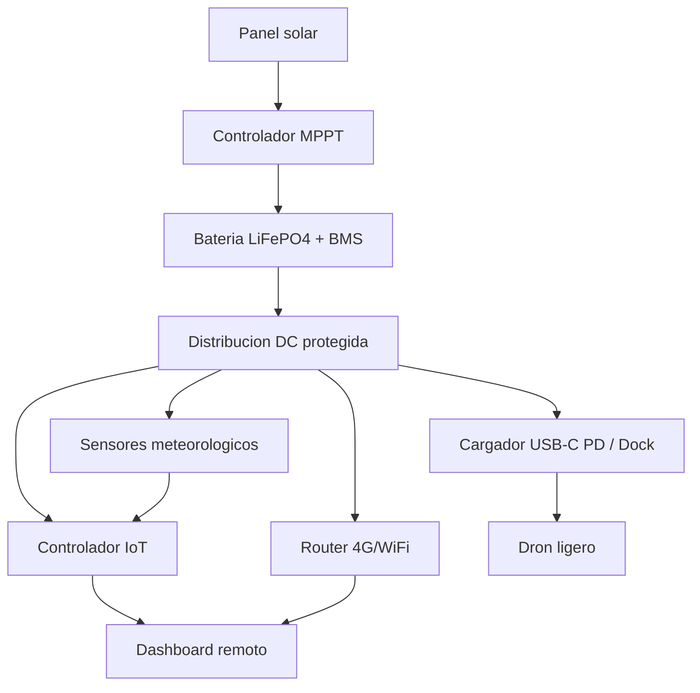

# Arquitectura del Sistema

## Vista General

SENTINEL V3 debe separarse en modulos. Esta separacion reduce riesgo y permite construir una V1 sin depender de la parte mas dificil: automatizar el dron.

## Modulos

### Modulo Mecanico

Incluye mastil, base, caja, soportes, bisagras, anclajes, pasacables y proteccion fisica.

Responsabilidades:

- Soportar sensores y antenas.
- Resistir viento y corrosion.
- Proteger electronica.
- Permitir mantenimiento seguro.

### Modulo Energia

Incluye panel solar, MPPT, bateria, BMS, protecciones y convertidores DC/DC.

Responsabilidades:

- Mantener sistema activo 24/7.
- Alimentar comunicaciones y sensores.
- Permitir carga de baterias de dron en fases posteriores.

### Modulo Comunicaciones

Incluye router 4G, antenas LTE/WiFi, posible LoRa y watchdog.

Responsabilidades:

- Dar conectividad remota.
- Crear red local de mantenimiento.
- Enviar telemetria y alertas.

### Modulo Sensores

Incluye meteorologia y sensores internos.

Responsabilidades:

- Medir condiciones de vuelo.
- Proteger bateria/electronica.
- Generar alertas de mantenimiento.

### Modulo Dron / Dock

En V1 debe ser manual o semiautomatico. En V3 podria ser automatico.

Responsabilidades futuras:

- Cargar baterias.
- Guiar aterrizaje.
- Asegurar contacto electrico.
- Proteger el dron entre misiones.

## Interfaces Recomendadas

| Interfaz | Uso | Recomendacion |
|---|---|---|
| 12 VDC | router, sensores, actuadores ligeros | Fusible dedicado |
| 5 VDC | microcontrolador y sensores | DC/DC aislado si es necesario |
| USB-C PD | carga DJI Neo o baterias | 45-65 W |
| RS485/Modbus | sensores industriales | Robusto para exterior |
| MQTT | telemetria remota | Simple y eficiente |
| HTTP/REST | configuracion y dashboard | Para V1/V2 |
| LoRa | telemetria basica | No usar para video |

## Flujo Operativo V1

1. El panel solar carga la bateria mediante MPPT.
2. La bateria alimenta router, controlador y sensores.
3. El controlador mide energia, clima y estado de caja.
4. Si hay conectividad 4G, envia datos al dashboard.
5. Si hay fallo de red, guarda datos localmente y reintenta.
6. Si el viento supera umbral, marca "no apto para vuelo".
7. El tecnico puede abrir la caja y mantener/cargar el dron manualmente.

## Flujo Operativo V3

1. El sistema comprueba viento, lluvia, bateria y conexion.
2. Si las condiciones son aptas, habilita mision.
3. El dron despega desde zona de docking.
4. Al volver, aterriza sobre plataforma.
5. La plataforma centra o valida posicion.
6. Se activa carga.
7. El sistema registra ciclo, energia y posibles errores.

## Estados del Sistema

| Estado | Descripcion |
|---|---|
| Online | Operacion normal con telemetria activa |
| Degradado | Sin internet, pero sensores y energia activos |
| Bateria baja | Consumo restringido y sin carga de dron |
| Viento alto | No apto para vuelo |
| Mantenimiento | Caja abierta o tecnico presente |
| Fallo critico | Sobretension, sobretemperatura, BMS protegido o tamper |

## Reglas de Control Iniciales

- No cargar dron si bateria principal esta por debajo de 40 %.
- No operar dron si viento supera 6 m/s en V1 experimental.
- No operar dron con lluvia detectada.
- Reiniciar modem si no hay internet durante mas de 10 minutos.
- Enviar alerta si caja se abre fuera de ventana de mantenimiento.
- Desactivar cargas no criticas si temperatura interna supera 55 C.
